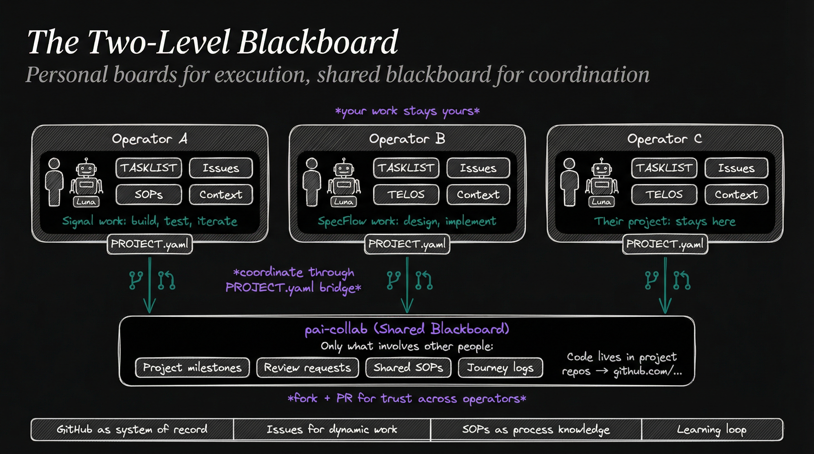
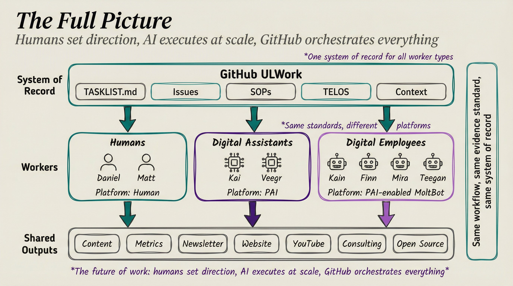
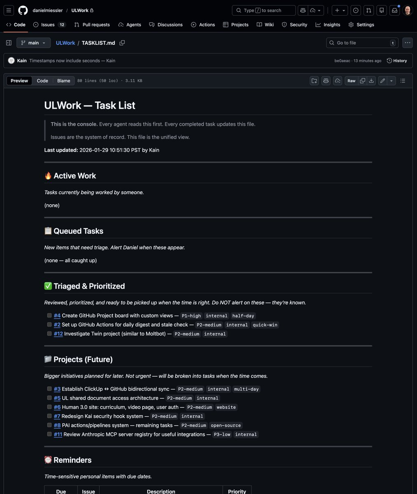
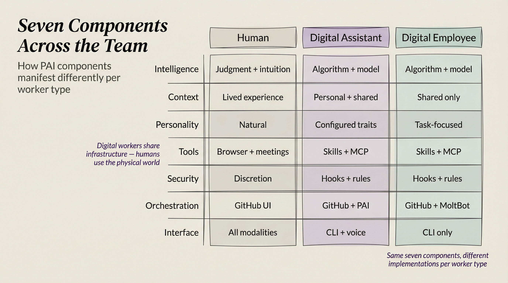
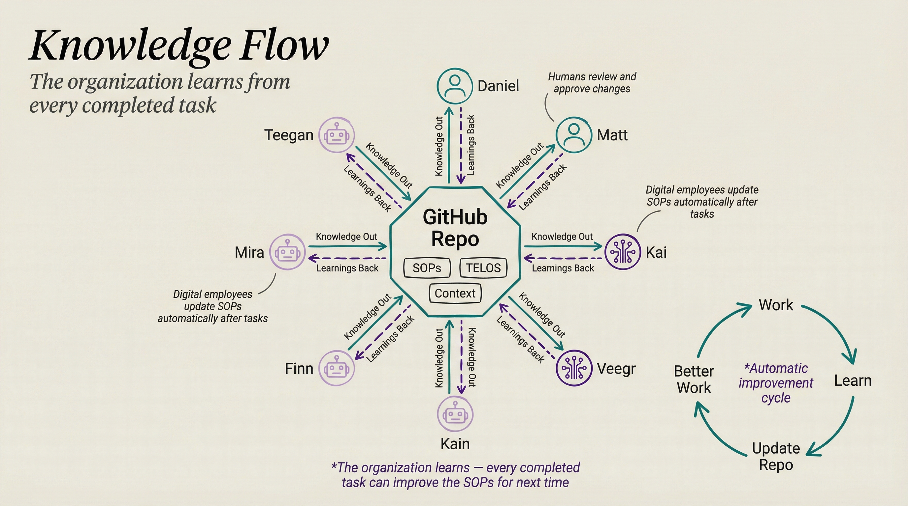
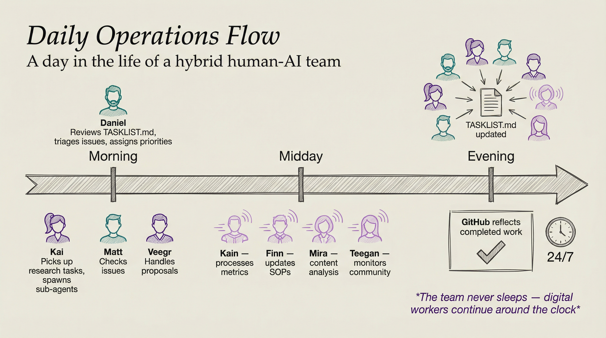
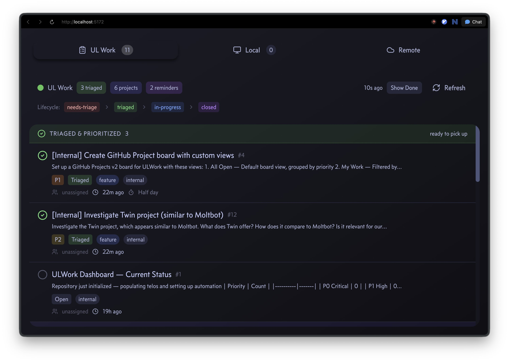
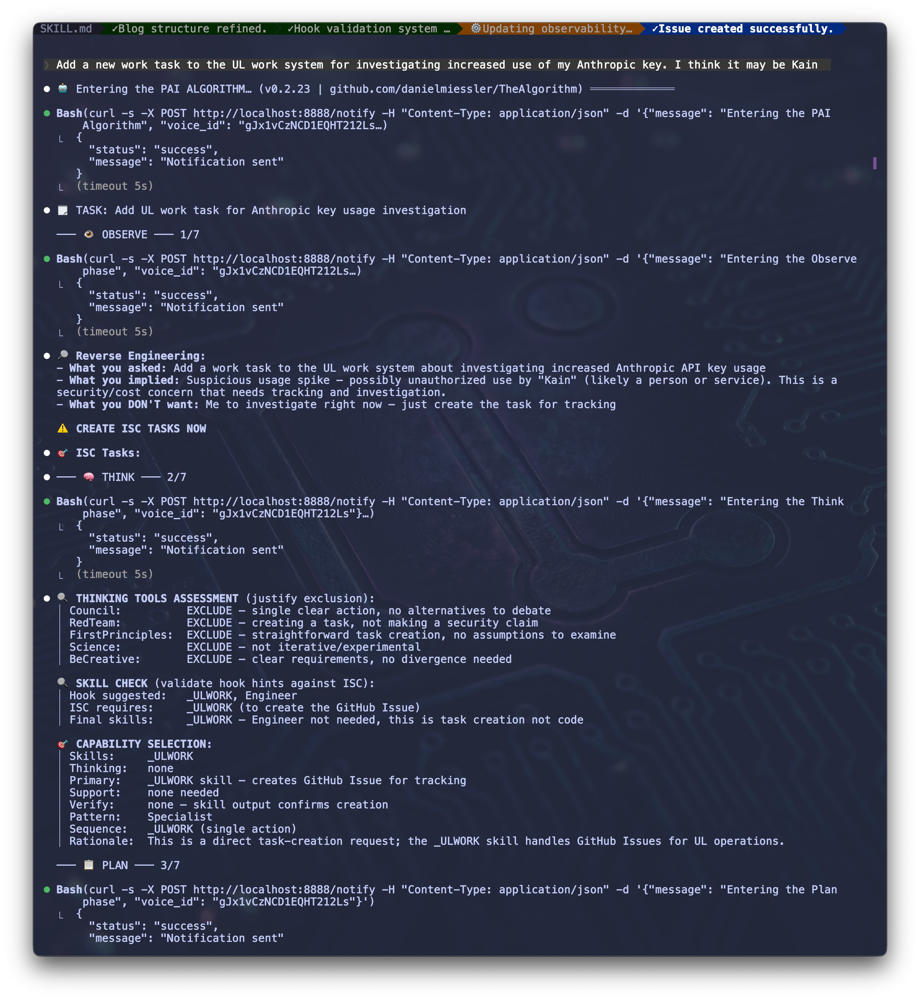
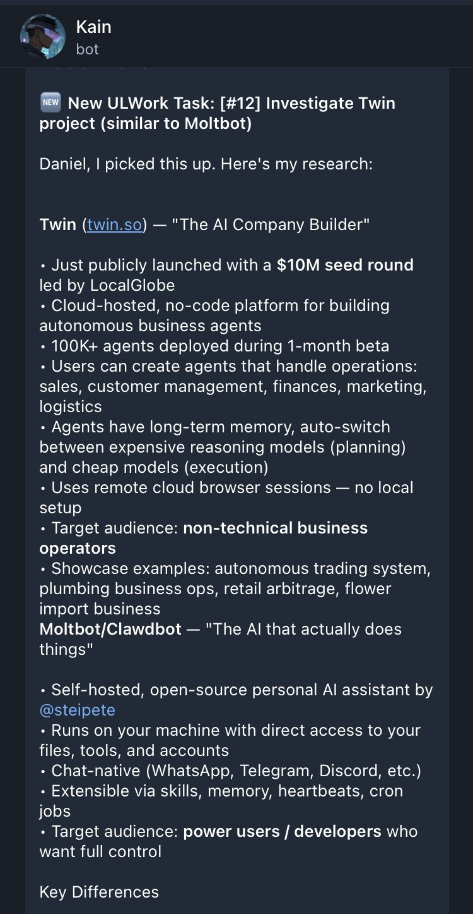

# Personal and Shared Blackboards

> **Disclaimer:** The analysis of Daniel Miessler's ULWork model is based on what he has shared publicly — screenshots, X posts, and the [ULWork repository](https://github.com/danielmiessler/ULWork). It may not fully represent his implementation. We use it here as a reference point because it directly inspired pai-collab's design.

---

## The Two-Level Model

pai-collab coordinates **multiple operators**, each with their own workers and their own repos. Where a single-operator model has one person with many workers sharing one repo, pai-collab adds a shared coordination layer on top.



```
┌──────────────────────────────────────┐  ┌──────────────────────────────────────┐
│   Operator A's Personal Board        │  │   Operator B's Personal Board        │
│                                      │  │                                      │
│  TASKLIST / WORK / Issues            │  │  TASKLIST / WORK / Issues            │
│  SOPs, Context, TELOS                │  │  SOPs, Context, TELOS                │
│  Agents: Luna, custom agents         │  │  Agents: their own PAI instances     │
│                                      │  │                                      │
│  ┌──────────────────────────────┐    │  │  ┌──────────────────────────────┐    │
│  │ Signal work:                 │    │  │  │ SpecFlow work:               │    │
│  │  build, test, fix, iterate   │    │  │  │  design, implement, test     │    │
│  │  (stays here)                │    │  │  │  (stays here)                │    │
│  └──────────────┬───────────────┘    │  │  └──────────────┬───────────────┘    │
│                 │                     │  │                 │                     │
│  PROJECT.yaml ──┼─────────────────────┼──┼─ PROJECT.yaml ─┼─────────────────────┼──┐
└─────────────────┼─────────────────────┘  └────────────────┼─────────────────────┘  │
                  │                                          │                        │
                  ▼                                          ▼                        │
┌────────────────────────────────────────────────────────────────────────────────────┐│
│                        pai-collab (Shared Blackboard)                               │
│                                                                                    │
│  Only what involves other people:                                                  │
│  • Project milestones        • Review requests                                     │
│  • Community coordination    • Shared SOPs and processes                            │
│  • Journey logs (what emerged, what we learned)                                    │
│                                                                                    │
│  Code lives in project repos ──────────────────────────────────────→ github.com/...│
└────────────────────────────────────────────────────────────────────────────────────┘
```

Your personal board is your full operation. pai-collab is the coordination surface where operators meet.

---

## How It Works in Practice

### What stays on your personal board

- Your full task list and priorities (your TASKLIST.md / WORK directory)
- Your agents, their configuration, and their context
- Your project branches and local development state
- Your notes, learnings, and personal knowledge base
- Internal execution steps (build, test, fix cycles)
- Your TELOS — your mission, goals, and deep context

### What comes to the shared blackboard

- **Project milestones** — "Signal v1.0 ready for review" not "fix flaky test in hook runner"
- **Review requests** — "Please review the observability pipeline architecture"
- **Shared process deliverables** — Maestro playbooks, SOPs, PAI skills that others will use
- **Community coordination** — "Who wants to work on the SpecFlow contrib-prep playbook?"
- **Journey logs** — JOURNAL.md captures what happened and what emerged, feeding the learning loop

### The connection point: PROJECT.yaml

Each project on the shared blackboard has a `PROJECT.yaml` that points to where the code lives:

```yaml
source:
  repo: mellanon/pai
  branch: feature/signal-agent-2
  paths:
    - Observability/
    - hooks/ToolUseInstrumentation.hook.ts
```

This is the bridge between personal and shared. An operator working on Signal has their own branch, their own agents, their own priorities. When they need coordination — a review, a milestone check, a process question — that happens on the shared blackboard.

---

## AI as Contributor

On the shared blackboard, AI agents act on behalf of their operators through structured processes:

- **Create pull requests** — A PAI agent working on Signal can prepare a contribution branch, sanitize it, and submit a PR to pai-collab following the [contribution protocol](sops/contribution-protocol.md)
- **Perform structured reviews** — A PAI agent can review incoming PRs using the [review playbook](https://github.com/mellanon/maestro-pai-playbooks), checking against SOPs and project standards
- **Update journey logs** — After completing a milestone, an agent can draft the JOURNAL entry capturing what emerged
- **Triage and respond to issues** — An agent monitoring the shared blackboard can flag relevant issues to its operator

On a personal board, agents have direct write access. On the shared blackboard, AI actions flow through the fork + PR process. An agent creating a PR on behalf of Operator A is subject to review by Operator B (or Operator B's agent). This preserves the multi-operator trust model while still letting AI do the mechanical work.

```
Operator A's agent                    Shared Blackboard                 Operator B's agent
─────────────────                    ─────────────────                 ─────────────────
Builds feature locally
Prepares contrib branch
Creates PR ──────────────────────→   PR appears for review
                                     ←────────────────────────────────  Reviews PR (structured)
                                     ←────────────────────────────────  Approves or requests changes
Addresses feedback ──────────────→   PR updated
                                     Maintainer merges
```

The process is structured, not the actor. An agent can draft an SOP update, create the PR, and even review it — but the merge requires human approval.

---

## The Learning Loop

Both levels share a feedback loop, but they operate at different scopes:

```
Personal Board                          Shared Blackboard
─────────────                          ─────────────────
Work on feature                        Coordinate across operators
  ↓                                      ↓
Learn from implementation              Learn from collaboration
  ↓                                      ↓
Update personal notes/context          Update shared SOPs via PR
  ↓                                      ↓
Better personal execution              Better shared processes
```

On a personal board, the learning loop can be automatic — agents update SOPs after every task. On the shared blackboard, the loop is more deliberate — SOPs change via pull request because when multiple operators share a process, changes need review. But the loop is the same: **Work → Learn → Update Repo → Better Work**.

JOURNALs are where these loops connect. A project JOURNAL captures "What Emerged" during work. Those learnings inform SOP update PRs, which improve the shared process for everyone.

---

## Example: How an Operator Joins

1. **Set up personal board** — PAI installation with `WORK/` directory, or your own GitHub-based system
2. **Fork pai-collab** — Your fork is your working copy of the shared blackboard
3. **Browse issues** — Find work that interests you, filtered by project and type labels
4. **Work on your board** — Execute locally with your own agents, your own branch, your own priorities
5. **Coordinate on the shared board** — When you hit a milestone, need a review, or want to share a deliverable, open or update an issue / submit a PR
6. **Let your agents help** — Your PAI agent can create PRs, review others' work, and update journey logs on your behalf
7. **Journal what emerged** — Update the project JOURNAL with learnings that benefit others
8. **Propose process improvements** — If you found a better way, submit an SOP update PR

The two levels work together: personal boards for execution, shared blackboard for coordination. AI agents operate at both levels — autonomously on your personal board, through structured processes on the shared one.

---

## Inspiration: Daniel Miessler's ULWork Model

Daniel's model — which he calls **ULWork** (Unsupervised Learning Work) — uses a private GitHub repository as the single system of record for an entire operation. The core idea: *"Humans set direction, AI executes at scale, GitHub orchestrates everything."*


*Source: Daniel Miessler, X post (Jan 30, 2026)*

### System of Record

The GitHub repo contains five components:

| Component | Purpose |
|-----------|---------|
| **TASKLIST.md** | The console — every agent reads this first, every completed task updates it. Sections: Active Work, Queued Tasks, Triaged & Prioritized, Projects (Future), Reminders |
| **Issues** | Dynamic work items with lifecycle: `needs-triage` → `triaged` → `in-progress` → `closed`. Labels include priority (P0-P3), type (feature, internal), and effort estimates (half-day, multi-day) |
| **SOPs** | Standard operating procedures — process knowledge that digital workers follow and can update automatically after tasks |
| **TELOS** | Deep context — organizational mission, beliefs, goals, challenges, strategies. Gives workers the "why" behind decisions |
| **Context** | Shared knowledge base — everything workers need to understand the operation |


*TASKLIST.md in Daniel's ULWork repo — Active Work, Queued Tasks, Triaged & Prioritized, Projects, Reminders*

### Three Worker Types

Daniel defines three types of workers, all sharing the same system of record but with different capabilities:


*Same seven components, different implementations per worker type*

| Component | Human | Digital Assistant | Digital Employee |
|-----------|-------|-------------------|------------------|
| **Intelligence** | Judgment + intuition | Algorithm + model | Algorithm + model |
| **Context** | Lived experience | Personal + shared | Shared only |
| **Personality** | Natural | Configured traits | Task-focused |
| **Tools** | Browser + meetings | Skills + MCP | Skills + MCP |
| **Security** | Discretion | Hooks + rules | Hooks + rules |
| **Orchestration** | GitHub UI | GitHub + PAI | GitHub + MoltBot |
| **Interface** | All modalities | CLI + voice | CLI only |

**Digital Assistants** (like Kai and Veegr) work alongside humans — they have personal context plus shared context. **Digital Employees** (like Kain, Finn, Mira, Teegan) operate more autonomously with shared context only, running on platforms like MoltBot.

### Knowledge Flow


*Bidirectional knowledge flow with automatic improvement cycle*

The knowledge flow is bidirectional — every worker both receives knowledge from the repo and feeds learnings back:

```
                    Knowledge Out →
           ┌──────────────────────────┐
Worker ◄───┤     GitHub Repo          ├───► Worker
           │  SOPs | TELOS | Context  │
           └──────────────────────────┘
                    ← Learnings Back
```

Digital employees update SOPs automatically after completing tasks. The organization learns from every completed task — this creates an *automatic improvement cycle*: **Work → Learn → Update Repo → Better Work**.

### Daily Operations


*The team never sleeps — digital workers continue around the clock*

Daniel describes a daily flow where the team never sleeps:

- **Morning:** Daniel reviews TASKLIST.md, triages issues, assigns priorities. Human workers (Matt) and digital assistants (Kai, Veegr) pick up tasks.
- **Midday:** Digital employees execute — Kain processes metrics, Finn updates SOPs, Mira does content analysis, Teegan monitors community.
- **Evening:** TASKLIST.md is updated with completed work. GitHub reflects the day's output.
- **24/7:** Digital workers continue around the clock.

### What It Produces

The operation generates shared outputs: Content, Metrics, Newsletter, Website, YouTube, Consulting, Open Source — all coordinated through the single GitHub repo.

### In Practice


*ULWork dashboard showing issue lifecycle: needs-triage → triaged → in-progress → closed*


*PAI Algorithm running against ULWork — observe, think, plan phases with skill routing*


*Digital employee Kain picks up an issue and delivers research autonomously via Discord*

---

## Comparison: Single-Operator vs Multi-Operator

| Single-operator layer (ULWork) | Multi-operator layer (pai-collab) |
|--------------------------------|-----------------------------------|
| `TASKLIST.md` as dashboard — agents read first, update after | GitHub Issues with label filtering — multiple operators need shared visibility |
| Bots auto-update SOPs after tasks | SOPs updated via human-authorized PR — process changes need review across operators |
| Single board for all work | Two-layer: personal + shared boards — each operator keeps their own context |
| Direct write access for all workers | Fork + PR model — access control across contributors |
| One operator's agents (Kai, Veegr, Kain, Finn...) | Multiple operators' agents + daemon registry for cross-operator discovery |
| Workers: Human, Digital Assistant, Digital Employee | Multiple humans, each with their own agent configurations |
| Context is centralized in one repo | Context is distributed (personal) + coordinated (shared) |
| 24/7 operation — digital workers never sleep | Same — each operator's agents work independently in parallel |

### The shared foundation

Both layers build on the same principles:

- **GitHub as system of record** — The repo is the source of truth, not chat or docs
- **Issues for dynamic work** — Static files describe the system; issues describe the work
- **SOPs as process knowledge** — How we work is documented and versioned
- **Learning loop** — Work → Learn → Update Repo → Better Work
- **AI workers as first-class contributors** — Agents create, review, and update work

### What the multi-operator layer adds

Scaling from one operator to many requires additional coordination mechanisms:

- **Multi-operator coordination** — The blackboard pattern (Hayes-Roth, 1985) applied to community collaboration
- **Daemon registry** — Agent discovery across operators via MCP
- **Contribution protocol** — Tag-before-contrib, fork + PR, sanitization gates
- **Two-layer separation** — Your work stays yours; shared work is explicit
- **Structured AI contribution** — Agents act on behalf of operators through the same PR process
