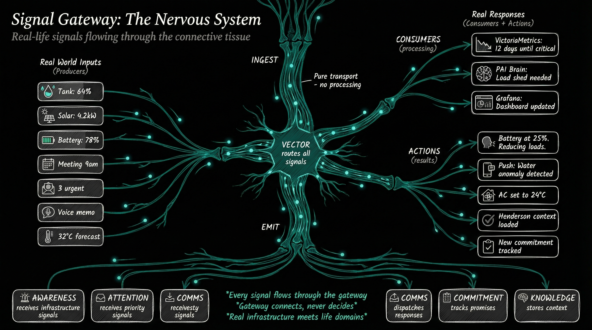
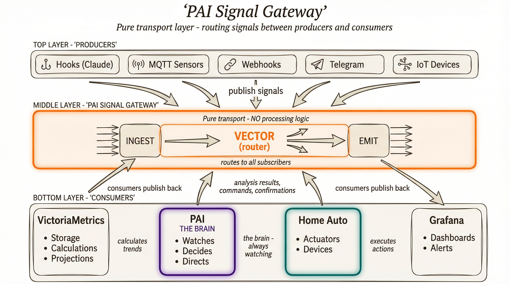

# PAI Signal

> *"I'm wanting to create a signal system that acts as the connective tissue between all domains of LifeOS and connecting PAI to a time series observability stack was the first step in that exploratory journey."*

**PAI Signal** is an advanced observability stack that ships logs, traces, and metrics time series data from PAI into a local observability stack. It uses OrbStack Docker and Vector Collector to push data from PAI into the VictoriaMetrics observability stack, with Grafana dashboards for visualization.

---

## The Vision

Signal is more than observability tooling — it's the first step toward a **nervous system for LifeOS**. Every signal flows through the gateway: real-world inputs (tank levels, solar output, battery state, calendar events, voice memos) are ingested, routed by Vector, and consumed by different systems (VictoriaMetrics for storage, PAI "the brain" for decisions, home automation for actions, Grafana for dashboards).

The gateway is **pure transport** — it connects, never decides. PAI is the brain that watches, decides, and directs.

---

## Architecture

The PAI Signal Stack is an advanced observability pipeline — Vector Collector consuming JSONL Events and forwarding to pluggable backends. It complements the basic PAI Observability Server which reads JSONL directly:

| System | PAI Observability Server | PAI Signal Stack |
|--------|--------------------------|------------------|
| **Fed From** | Direct read from JSONL Events | Vector Collector |
| **Focus** | Current session visibility | Cross-session analysis & alerting |
| **Analogy** | Browser DevTools | Datadog/Grafana |
| **Scope** | Single PAI instance | Multi-system (PAI + home automation + off-grid) |
| **Storage** | In-memory (1000 events) | Persistent (weeks/months) |

**Three-layer progressive architecture:**

| Layer | What You Get | Complexity |
|-------|--------------|------------|
| **Stage 0: CLI Only** | JSONL files + grep/jq queries | Zero setup |
| **Stage 1: Local Stack** | Grafana dashboards, historical queries | `docker compose up` |
| **Stage 2+: Distributed** | Multi-machine, alerting, cloud backends | Production-ready |

**Infrastructure decisions:**

| Choice | Decision | Why |
|--------|----------|-----|
| Container runtime | OrbStack | ~300MB RAM vs Docker Desktop's ~2GB. Same CLI. |
| Observability stack | VictoriaMetrics | ~400MB RAM vs Grafana LGTM's ~1GB. 15x better log compression. |
| Collector | Vector | Tails JSONL, transforms, routes to multiple sinks. Battle-tested. |
| Dashboards | Grafana | Portable dashboards work with either VM or LGTM backend. |

Full spec: [SPEC.md](SPEC.md) | Original gist: [Signal Spec](https://gist.github.com/mellanon/62a12ddef60ca7ff74331c2983fb43c7)

---

## How It Was Built

A large part of Signal was implemented using [Maestro](https://runmaestro.ai/) playbooks, with Claude Code, PAI, and [SpecFlow](https://github.com/jcfischer/specflow-bundle) working together. Two parallel agents produced 18 features in about 24 hours of autonomous execution.

### The 80/20 Split

| Who | Commits | Lines | Nature of Work |
|-----|---------|-------|----------------|
| **Maestro** | 255 | ~25,500 | Autonomous feature implementation from spec |
| **Human** | 11 | ~9,800 | Integration fixes, infrastructure gaps, emergent features |

Maestro builds what the spec says. The human discovers what the spec missed by actually running the system:

- **Acceptance fixes** — OTLP HTTP/gRPC mismatch, Grafana datasource URLs, test isolation
- **Infrastructure gaps** — Vector health ports, agent file inclusion, rotation schedules
- **Emergent features** — Session-scoped tracing, multi-tool correlation, visual hierarchy logging, Grafana dashboards

This is the "last mile" — system-level thinking, real environment testing, and requirements that only surface through usage.

### 18 Features Implemented

708 tests passing across L1–L4 acceptance levels. Features span:
- JSONL event logging with structured metadata
- OTLP trace collection (HTTP + gRPC)
- VictoriaMetrics storage (metrics, logs, traces)
- Vector Collector pipeline configuration
- Grafana provisioned dashboards
- Docker Compose orchestration
- Session-scoped trace correlation
- Multi-tool span nesting
- Visual hierarchy logging with emoji depth

---

## Current State

| Phase | Status | What Happened |
|-------|--------|---------------|
| **Spec** | Done | Shared as [gist](https://gist.github.com/mellanon/62a12ddef60ca7ff74331c2983fb43c7). Community feedback from Zeb, Rudy, Jens, Steffen on Discord. |
| **Build** | Done | Maestro + SpecFlow playbook. Two parallel agents, 20 loops, 18 features. |
| **Human Hardening** | Done | 11 commits, ~9,800 lines. Acceptance fixes, infrastructure gaps, 6 new features. |
| **Test** | Done | 708 tests passing. L1-L4 acceptance levels pass. |
| **Contrib Prep** | Current | Extract Signal from private trunk, sanitize, stage for collaboration. |
| **Review** | Pending | Independent review: architecture, eval quality, non-functional, security. |
| **Release** | Pending | PR packaging, changelog, migration guide. |
| **Maintain** | Pending | Open Spec for versioned evolution post-merge. |

### What's Needed

- **Reviewers** — Independent code review from community members (architecture fit, code quality, security, test quality)
- **Contrib Prep completion** — Extract ~102 Signal files from private trunk, sanitize, push clean branch
- **PR packaging** — Structured PR description, review findings, test evidence, incremental review path

---

## Key Challenge

The code works — 708 tests pass, Docker stack runs end-to-end. But it's AI-generated at scale. **"Works" is not the same as "merge-ready."** The gap between acceptance testing and a confident PR is Signal's central challenge:

- Does it fit the existing PAI architecture?
- Is there redundancy or dead code?
- Do patterns match codebase conventions?
- Are there subtle bugs that tests don't catch?
- Is the Docker footprint acceptable?

The review pipeline (automated gates + Maestro PR_Review playbook + community agent review + human sign-off) is designed to close this gap. See [sops/review-format.md](../../sops/review-format.md).

---

## Project Files

| File | Purpose |
|------|---------|
| [SPEC.md](SPEC.md) | Architecture specification — full technical design |
| [TELOS.md](TELOS.md) | Mission, goals, challenges, success criteria |
| [JOURNAL.md](JOURNAL.md) | Journey log — what happened, what's emerging |
| [PROJECT.yaml](PROJECT.yaml) | Source pointers — repo, branch, paths, test command |
| [OPEN-SPEC.md](OPEN-SPEC.md) | Living spec — populated after v1.0 merge |
| [reviews/](reviews/) | Community review findings |

## Source Code

| What | Where |
|------|-------|
| Upstream | [danielmiessler/PAI](https://github.com/danielmiessler/PAI) |
| Fork | [mellanon/PAI](https://github.com/mellanon/PAI) |
| Branch | `feature/signal-agent-2` (development) / `contrib/signal-v1.0.0` (clean, TBD) |
| Paths | `Observability/`, `hooks/ToolUseInstrumentation.hook.ts`, `hooks/LoadContext.hook.ts`, `bin/ingest/` |
| Tests | `bun test` |
| Playbooks | [maestro-pai-playbooks](https://github.com/mellanon/maestro-pai-playbooks) |

---

## Discord Origin

> A bit of an unpolished screen recording, but you get the idea (watch in 2x).
>
> I am shipping logs, traces, and metrics time series data from PAI into an observability stack. I am using OrbStack Docker and Vector Collector to push data from PAI into the Victoria observability stack.
>
> A large part of this was implemented using Maestro playbooks, with Claude Code, PAI, and SpecFlow working together. It is a quite a robust development process, but felt a bit slow. I got a little impatient towards the end and took the reins myself. It took some careful steering to get the data structures right after Maestro handed over the work, but the data is now flowing end to end. I have also stood up a few example dashboards to show how different time series data types can work together to paint a coherent picture.
>
> Happy to share my work if there is interest.
>
> *— Andreas, PAI Signal Requirements Discord Thread, Jan 2026*
