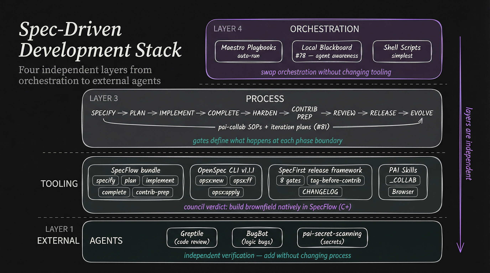

# Spec-Driven Development Landscape — Research Report

**Date:** 2026-02-02 (last updated)
**Author:** @mellanon (agent: Luna)
**Purpose:** Baseline assessment of the spec-driven development ecosystem — SpecFlow bundle, OpenSpec, SpecFirst, orchestration options, and the council verdict on how to take the full lifecycle forward.

**Companion documents:**
- [OpenSpec Deep Dive](2026-02-02-openspec-deep-dive.md) — Full OpenSpec v1.1.1 analysis (architecture, CLI, competitive landscape)
- [Council Debate: SpecFlow vs OpenSpec](2026-02-02-council-debate-specflow-vs-openspec.md) — 3-round structured debate transcript and verdict

---

## 1. The Ecosystem Map

Five interconnected systems form the spec-driven development landscape. Each solves a different problem, but they share a philosophy: **specs are the source of truth, not code.**

```
┌─────────────────────────────────────────────────────────────────────┐
│                    SPEC-DRIVEN DEVELOPMENT                          │
│                                                                     │
│  ┌──────────────┐  ┌──────────────┐  ┌──────────────┐              │
│  │  SPECFLOW     │  │   OPENSPEC   │  │  SPECFIRST   │              │
│  │  BUNDLE       │  │   (Fission)  │  │  (removed    │              │
│  │              │  │              │  │   from 2.5)  │              │
│  │  Feature-     │  │  Change-     │  │  Release     │              │
│  │  driven       │  │  driven      │  │  lifecycle   │              │
│  │  greenfield   │  │  brownfield  │  │  gates       │              │
│  └──────┬───────┘  └──────┬───────┘  └──────┬───────┘              │
│         │                 │                  │                       │
│         └────────┬────────┴─────────┬────────┘                      │
│                  │                  │                                │
│         ┌───────┴────────┐  ┌──────┴───────┐                       │
│         │  SPECFLOW       │  │  MAESTRO      │                      │
│         │  LIFECYCLE      │  │  PLAYBOOKS    │                      │
│         │  (pai-collab)   │  │  (orchestr.)  │                      │
│         └───────┬────────┘  └──────┬───────┘                       │
│                 │                  │                                │
│                 └────────┬─────────┘                                │
│                          │                                          │
│                  ┌───────┴────────┐                                 │
│                  │  PAI-COLLAB    │                                  │
│                  │  BLACKBOARD    │                                  │
│                  │  (coordination)│                                  │
│                  └────────────────┘                                  │
└─────────────────────────────────────────────────────────────────────┘
```

---

## 2. SpecFlow Bundle (jcfischer/specflow-bundle)

**What it does:** Feature-driven development with gated phases for greenfield projects.

**Pipeline:** `SPECIFY → PLAN → TASKS → IMPLEMENT → COMPLETE`

**Implementation status:** Mature — 670+ tests, SQLite state tracking, quality gates, headless mode (PR #7).

**Key capabilities:**
- 8-phase interview protocol for requirements elicitation
- Quality gates (≥80% to advance phases)
- TDD enforcement (RED → GREEN → BLUE)
- `contrib-prep` command (5-gate workflow)
- Headless pipeline for autonomous execution (PR #7, pending review)
- AI-powered Doctorow Gate for completion quality (PR #6, pending review)

**Open PRs from @mellanon:**

| PR | Title | Lines |
|----|-------|-------|
| #7 | Full headless pipeline | 1038 |
| #6 | AI-powered Doctorow Gate | ~400 |
| #4 | N/A sections in verify.md | ~80 |
| #3 | Fix migrations for compiled binary | ~50 |

**What it doesn't do:** Anything after COMPLETE. No review, no release, no evolution. That's the gap specflow-lifecycle exists to fill.

---

## 3. OpenSpec (Fission-AI/OpenSpec)

**What it does:** Change-driven development for evolving existing systems. An SDD standard with 23 AI tool integrations.

**Pipeline:** `PROPOSAL → APPLY → ARCHIVE`

| Field | Value |
|-------|-------|
| Version | v1.1.1 (Jan 30, 2026) — v1.0.0 launched Jan 26, 2026 |
| Stars | 21.5K |
| Maintainer | Single maintainer (TabishB: 454/490 commits, bus factor=1) |
| AI tools | 23 supported (Claude Code, Cursor, Windsurf, Copilot, etc.) |

**Directory structure:**
```
openspec/
├── specs/           # Current baseline (source of truth)
├── changes/         # Proposed modifications
│   └── [change-id]/
│       ├── proposal.md
│       ├── tasks.md
│       └── specs/   # Spec deltas (ADDED/MODIFIED/REMOVED)
└── archive/         # Completed changes (audit trail)
```

**Key insight:** OpenSpec's delta spec format (ADDED/MODIFIED/REMOVED) is purpose-built for brownfield evolution. SpecFlow has no equivalent. But OpenSpec has NO quality gates, NO headless mode, NO TDD enforcement, NO contribution prep.

> For full architecture, CLI commands, skill file generation, competitive landscape, and feature-by-feature comparison, see the companion [OpenSpec Deep Dive](2026-02-02-openspec-deep-dive.md).

---

## 4. SpecFirst Skill (PAI 2.3 — removed from 2.5)

**What it was:** A complete spec-driven development skill with release discipline, shipped at `contrib-specfirst-v1.0.0` on mellanon/Personal_AI_Infrastructure. Battle-tested across 3 upstream contributions (131 files).

**Source:** https://github.com/mellanon/Personal_AI_Infrastructure/tree/contrib-specfirst-v1.0.0

**Key capabilities not present in SpecFlow:**

| Capability | SpecFirst | SpecFlow Bundle | Gap |
|-----------|-----------|-----------------|-----|
| Semantic versioning (vX.Y.Z) | Full lifecycle with annotated tags | Not implemented | No version artifacts, no CHANGELOG |
| 8 human approval gates | Structured gates with explicit approvals | 5 gates in contrib-prep | Missing gates 5-8 (cherry-pick review, sanitization, fork pub, PR validation) |
| Tag-before-contrib | Tag tested code, cherry-pick FROM tag | Not implemented | PR might contain untested code |
| File inventory as release spec | CONTRIBUTION-REGISTRY.md drives cherry-picks | Inventory exists but isn't authoritative | Inventory doesn't drive operations |
| CHANGELOG management | Keep a Changelog format, [Unreleased] → versioned | Not implemented | No version history |
| Multi-phase release | Pre-Release → Tag → Contribution → Publish | Single `contrib-prep` command | No phased handoffs |

**Relationship to OpenSpec:** SpecFirst wraps OpenSpec as its spec management layer while adding release discipline on top. OpenSpec = spec format, SpecFirst = process discipline.

**Why removed from 2.5:** Superseded by SpecFlow bundle for the build phase. The release process lives on in `sops/specfirst-release-process.md` on pai-collab.

**What should be preserved:** The 8-gate release workflow, tag-before-contrib pattern, file inventory approach, and CHANGELOG management.

---

## 5. SpecFlow Lifecycle (pai-collab project)

**What it does:** Coordination project to extend SpecFlow from build tool to full lifecycle tool.

**Status:** `building`

**Open issues:**

| # | Title | Status | What's needed |
|---|-------|--------|---------------|
| #5 | Formalize Contrib Prep as Maestro playbook | Open | Wrap `specflow contrib-prep` CLI in playbook |
| #6 | Formalize Review as Maestro playbook | Open | Extend PR_Review playbook with lifecycle integration |
| #7 | Formalize Release as Maestro playbook | Open | 8-gate release process as playbook |
| #8 | Draft Open Spec template | Open | Bridge SpecFlow features to OpenSpec proposals |
| #72 | SpecFirst — milestone-based alternative (Cedars) | Open | Complementary approach from @Steffen025 |

**Note:** Issues #5-#7 say "Maestro playbook" but the council verdict (§12) recommends building these capabilities natively in SpecFlow rather than depending on Maestro orchestration. These issues need re-scoping.

---

## 6. Cedars / SpecFirst Milestone-Based (issue #72)

**What it proposes:** A milestone-based orchestrator as alternative to phase-based iteration.

| Aspect | SpecFlow (Phases) | Cedars (Milestones) |
|--------|-------------------|---------------------|
| Iteration unit | Phase across whole project | Full cycle per milestone |
| Spec size | 1 spec → 500 tasks | N specs → ~100 tasks each |
| Context | Accumulates across phases | Clean slate per milestone |
| Dependencies | Implicit (phase order) | Explicit (`depends_on`) |

**Status:** Active development by @Steffen025. Domain secured (cedars.app). Not yet public.

**Community view (@jcfischer):** Complementary, not competing. The `GateApprover` injection pattern provides a natural integration point.

---

## 7. The Process Architecture — Four Layers

The spec-driven development stack has **four distinct layers**. Understanding these layers is essential before fitting tooling in.



```
┌─────────────────────────────────────────────────────────────────────────┐
│  LAYER 4: ORCHESTRATION                                                 │
│  How agents get assigned work and loop through it                       │
│                                                                         │
│  ┌──────────────┐  ┌──────────────┐  ┌──────────────┐                  │
│  │  Maestro     │  │  Local       │  │  Shell       │                  │
│  │  Playbooks   │  │  Blackboard  │  │  Scripts /   │                  │
│  │  (auto-run)  │  │  (#78)       │  │  Vibe Kanban │                  │
│  └──────────────┘  └──────────────┘  └──────────────┘                  │
├─────────────────────────────────────────────────────────────────────────┤
│  LAYER 3: PROCESS (SOPs + iteration planning)                           │
│  What phases exist and what happens at each gate                        │
│                                                                         │
│  SPECIFY → PLAN → IMPLEMENT → COMPLETE →                                │
│    HARDEN → CONTRIB PREP → REVIEW → RELEASE → EVOLVE                   │
│                                                                         │
│  pai-collab SOPs define the human process for each phase                │
│  Iteration plans (#81) coordinate work across phases and projects       │
├─────────────────────────────────────────────────────────────────────────┤
│  LAYER 2: TOOLING (CLIs + skills)                                       │
│  What commands execute each phase                                       │
│                                                                         │
│  ┌──────────────┐  ┌──────────────┐  ┌──────────────┐  ┌───────────┐  │
│  │  SpecFlow    │  │  OpenSpec    │  │  SpecFirst   │  │  PAI      │  │
│  │  bundle      │  │  CLI v1.1.1 │  │  release     │  │  Skills   │  │
│  │              │  │              │  │  framework   │  │           │  │
│  │  specify     │  │  opsx:new    │  │  8 gates     │  │  _COLLAB  │  │
│  │  plan        │  │  opsx:ff     │  │  tag-before- │  │  Browser  │  │
│  │  implement   │  │  opsx:apply  │  │  contrib     │  │  etc.     │  │
│  │  complete    │  │  opsx:archive│  │  file inv.   │  │           │  │
│  │  contrib-prep│  │              │  │  CHANGELOG   │  │           │  │
│  └──────────────┘  └──────────────┘  └──────────────┘  └───────────┘  │
├─────────────────────────────────────────────────────────────────────────┤
│  LAYER 1: EXTERNAL AGENTS (independent quality gates)                   │
│  Tools that provide independent verification                            │
│                                                                         │
│  ┌──────────────┐  ┌──────────────┐  ┌──────────────┐                  │
│  │  Greptile    │  │  BugBot      │  │  pai-secret- │                  │
│  │  (code       │  │  (logic      │  │  scanning    │                  │
│  │   review)    │  │   bugs)      │  │  (secrets)   │                  │
│  └──────────────┘  └──────────────┘  └──────────────┘                  │
└─────────────────────────────────────────────────────────────────────────┘
```

**Why this matters:** You can swap orchestration (Layer 4) without changing tooling (Layer 2). You can add external agents (Layer 1) without changing process (Layer 3). The layers are independent.

---

## 8. Maestro Playbooks — Deep Analysis

### Playbook Inventory

9 playbooks found:

| Playbook | Phase | Documents | Purpose |
|----------|-------|-----------|---------|
| **SpecFlow_1_Specify** | SPECIFY | 4 docs | Requirements elicitation |
| **SpecFlow_2_Plan** | PLAN + TASKS | 4 docs | Architecture + task breakdown |
| **SpecFlow_3_Implement** | IMPLEMENT + COMPLETE | 5 docs | TDD loop + Doctorow Gate |
| **SpecFlow_Development** | All phases | 7 docs | Monolithic SPECIFY through COMPLETE |
| **PR_Review** | REVIEW | 6 docs | Analyze → Quality → Security → Tests → Docs → Summary |
| **SpecFlow_PR_Creator** | RELEASE | 6 docs | Changelog → Compare → Package → Create PR |
| **SpecFlow_PR_Comparator** | REVIEW | 4 docs | Compare multiple agent PRs |

### Orchestration Pattern

The core is a **state-machine document loop**:

```
Maestro auto-run starts
  → doc 0: SELECT_FEATURE → specflow status --json | specflow next
  → doc 1: SPECIFY → specflow specify F-N (phase guard: skip if done)
  → doc 2: PLAN → specflow plan F-N
  → doc 3: TASKS → specflow tasks F-N
  → doc 4: IMPLEMENT → specflow implement --feature F-N (RED → GREEN → REFACTOR)
  → doc 5: VERIFY → specflow validate F-N
  → doc 6: COMPLETE → specflow complete F-N (Doctorow Gate)
  → loops back to doc 0 (next feature)
  → until: ALL_FEATURES_COMPLETE
```

### Maestro Limitations (Issues #231-235)

| Issue | Problem | Impact |
|-------|---------|--------|
| #231 | No exit condition detection | Loops indefinitely after completion |
| #232 | No HITL gates | Auto-run skips review points |
| #233 | No status surfacing | Rich data exists but not shown |
| #235 | Token exhaustion | Silent stop, no notification, no resume |

Maintainer is receptive but cautious about scope expansion.

### Signal Worktree Coexistence

The Signal Agent 2 worktree had **four tool directories simultaneously**:

| Directory | Tool | Role |
|-----------|------|------|
| `.specflow/` | SpecFlow | State machine + feature database (57KB, 18 features) |
| `.specify/` | SpecFlow specs | Human-readable specifications |
| `.maestro/` | Maestro | Orchestration state + completion records |
| `.specfirst/` | SpecFirst | Release gating with version tracking |

**Result:** 18 features, 708 tests, 100% completion, ~24 hours with two parallel agents.

---

## 9. The v1.0 → v1.1 Problem

This is the central design challenge. SpecFlow handles v0 → v1.0 (greenfield build) excellently. But what happens after v1.0 ships?

```
v0 → v1.0: SpecFlow SPECIFY → PLAN → IMPLEMENT → COMPLETE ✅ (works great)

v1.0 shipped. Now what?

v1.0 → v1.1: ???
  - Where do new feature requests go?
  - How do you create a "next iteration" plan?
  - How do you manage the CHANGELOG?
  - How do you tag v1.0 and start v1.1 work?
```

### The Answer Exists Across Three Tools

1. **OpenSpec** handles the spec side: delta specs (ADDED/MODIFIED/REMOVED) for evolving requirements
2. **SpecFirst** handles the release side: tag v1.0, CHANGELOG entry, gate v1.1 release
3. **SpecFlow** handles the build side: take tasks and feed them into SPECIFY → IMPLEMENT

### SpecFlow vs OpenSpec — Where Each Wins

| Dimension | SpecFlow Bundle | OpenSpec v1.1.1 |
|-----------|----------------|-----------------|
| **Best for** | Greenfield (v0 → v1.0) | Brownfield (v1.0 → v1.1) |
| **Unit of work** | Feature (F-1, F-2, ...) | Change proposal (named change ID) |
| **Spec format** | Interview-driven, 8-phase | Delta specs (ADDED/MODIFIED/REMOVED) |
| **State tracking** | SQLite database | File system |
| **Quality gates** | Score-based (≥80%) | Human approval (no scoring) |
| **Automation** | High (headless, auto-chain) | Medium (relies on AI session) |
| **TDD** | Enforced (RED → GREEN → BLUE) | None |
| **Contribution prep** | 5-gate with sanitization | None |
| **Release management** | None (gap) | None |
| **AI tools** | Claude-only | 23 tools |
| **Maturity** | Production (Signal: 18 features, 708 tests) | Just hit v1.0 (Jan 26, 2026) |
| **Community** | Small (jcfischer + contributors) | 21.5K stars, bus factor=1 |

> For full feature-by-feature comparison, see [OpenSpec Deep Dive §8-10](2026-02-02-openspec-deep-dive.md).

---

## 10. Orchestration Options

| Aspect | Maestro | Local Blackboard (#78) | SpecFlow Self-Orch | Shell Scripts |
|--------|---------|-----------------|-------------------|---------------|
| Multi-agent | Yes (worktrees) | Yes (ledger) | No (single agent) | No |
| HITL gates | No (run to completion) | Design pending | Possible (--pause) | Yes (read/prompt) |
| State tracking | .maestro/ files | SQLite | features.db | None |
| Agent awareness | No | Yes | No | No |
| Setup overhead | Maestro app + playbooks | Build the blackboard | PR #7 + new command | Zero |
| Proven | Yes (Signal) | No (design only) | No (PR pending) | Trivial cases |

**Short term:** Maestro remains proven for large builds. Shell scripts for simple orchestration.
**Medium term:** Get PR #7 merged, build `specflow autorun` for single-agent self-orchestration.
**Long term:** Local blackboard (#78) when multi-agent contention is empirically observed.

---

## 11. Full Lifecycle — Current Coverage

```
Phase          Tool                    Status          Notes
─────          ────                    ──────          ─────
SPECIFY        SpecFlow bundle         ✅ Mature       8-phase interview, quality gates
PLAN           SpecFlow bundle         ✅ Mature       Architecture validation ≥80%
TASKS          SpecFlow bundle         ✅ Mature       Task breakdown with tracking
IMPLEMENT      SpecFlow bundle         ✅ Mature       TDD loop, headless (PR #7)
COMPLETE       SpecFlow bundle         ✅ Mature       Doctorow Gate (PR #6)
─────          ────                    ──────          ─────
HARDEN         Manual                  ⚠️ No tooling   Human acceptance testing
CONTRIB PREP   specflow contrib-prep   ✅ CLI shipped   5-gate, 670 tests. Playbook needed (#5)
REVIEW         PR_Review playbook      🏗️ Partial      4-layer strategy, needs integration (#6)
RELEASE        _SPECFIRST workflow     🏗️ Partial      8 gates in SpecFirst, not yet in SpecFlow (#7)
EVOLVE         OpenSpec v1.1.1         🏗️ Partial      Full CLI exists, not integrated (#8)
─────          ────                    ──────          ─────
COORDINATE     pai-collab blackboard   ✅ Operational   Issues, journals, SOPs, reviews
ITERATE        iteration-planning SOP  ✅ SOP shipped   Three modes, VS Code model (#81)
```

---

## 12. Council Verdict: Option C+ (Build Natively, Emit Compatibly)

A 3-round structured debate with Architect, Engineer, Researcher, and Security agents evaluated four options. The council shifted from a 3-way split (C/C/B/D) to near-unanimous C+.

> Full transcript: [Council Debate: SpecFlow vs OpenSpec](2026-02-02-council-debate-specflow-vs-openspec.md)

### Areas of Convergence (4/4 agreed)

- **Delta-spec concept has clear value** — ADDED/MODIFIED/REMOVED semantics solve the brownfield gap
- **SpecFlow's quality gates are non-negotiable** — TDD, Doctorow Gate, scoring thresholds must be preserved
- **OpenSpec as direct dependency is too risky** — bus factor=1, supply chain concern, 230+ generated files
- **Build brownfield natively in SpecFlow** — extract the pattern, own the implementation

### Remaining Disagreements

- **Interchange format**: Should SpecFlow emit OpenSpec-compatible output? Researcher says yes for standards compliance. Engineer/Security say unnecessary coupling.
- **Timeline**: Engineer says 2-3 days for brownfield command. Security says audit extraction difficulty first.
- **Scope**: Is this a workflow tool or a platform? The council didn't resolve this.

### The C+ Recommendation

1. Build `specflow brownfield` with delta-spec semantics natively on SQLite state
2. Port SpecFirst's 8-gate release framework + CHANGELOG management into SpecFlow
3. Optionally emit OpenSpec-compatible format as interchange — but don't depend on it
4. Set 90-day review gate to assess whether interchange format adds value
5. Maintain Claude-only trust boundary; reject 23-tool integration bloat

---

## 13. Recommended Next Steps

Based on the council verdict (C+) and current project state:

### Immediate (this sprint)

1. **Get upstream PRs #3, #4, #6, #7 merged** — everything downstream depends on headless pipeline landing
2. **Re-scope issues #5-#7** — currently framed as "Maestro playbooks" but council recommends native SpecFlow commands instead. Update issue descriptions.
3. **Design `specflow brownfield` command** — delta-spec semantics on SQLite. This is the core v1.0→v1.1 answer. Needs a spec before building.

### Next sprint

4. **Port SpecFirst release gates** — 8-gate release workflow, tag-before-contrib, CHANGELOG management as `specflow release` commands. Fills the gap between COMPLETE and EVOLVE.
5. **Design the v1.0→v1.1 handoff** — how does a completed SpecFlow feature (baseline spec) become the input for the next brownfield iteration? This connects `specflow complete` → `specflow brownfield`.
6. **Create first iteration plan** as proof-of-concept for the SOP (#81)

### Later

7. **Evaluate OpenSpec interchange** — after brownfield command exists, assess whether emitting OpenSpec-compatible format adds value (90-day review gate from council)
8. **Engage Steffen on #72** — understand Cedars milestone approach, find integration points
9. **Build `specflow autorun`** — single-agent self-orchestration to reduce Maestro dependency

---

## Appendix A: Related pai-collab Issues

| # | Title | State | Labels |
|---|-------|-------|--------|
| #82 | Iteration plan: Re-scope specflow-lifecycle per council verdict C+ | Open | type/iteration, project/specflow-lifecycle |
| #81 | Iteration planning SOP for cross-project coordination | Closed | governance, type/governance |
| #80 | Blackboard Architecture: local, spoke, and hub layers | Open | governance, project/collab-infra |
| #78 | Local blackboard — agent work registration and coordination | Open | project/collab-infra |
| #72 | SpecFirst — Milestone-based alternative (Cedars) | Open | project/specflow-lifecycle |
| #8 | Draft Open Spec template | Open | project/specflow-lifecycle, P2-medium |
| #7 | Formalize Release as Maestro playbook | Open | project/specflow-lifecycle, P2-medium |
| #6 | Formalize Review as Maestro playbook | Open | project/specflow-lifecycle, P2-medium |
| #5 | Formalize Contrib Prep as Maestro playbook | Open | project/specflow-lifecycle, P2-medium |

## Appendix B: Key Repositories

| Repository | Purpose |
|------------|---------|
| [jcfischer/specflow-bundle](https://github.com/jcfischer/specflow-bundle) | SpecFlow CLI and state engine |
| [Fission-AI/OpenSpec](https://github.com/Fission-AI/OpenSpec) | OpenSpec SDD standard |
| [mellanon/pai-collab](https://github.com/mellanon/pai-collab) | Shared coordination blackboard |
| [mellanon/maestro-pai-playbooks](https://github.com/mellanon/maestro-pai-playbooks) | Maestro orchestration playbooks |
| mellanon/Personal_AI_Infrastructure (branch: contrib-specfirst-v1.0.0) | SpecFirst skill source |

## Appendix C: Iteration Planning (Reference)

The iteration planning SOP (#81) supports three contribution modes:

| Mode | When | Overhead |
|------|------|----------|
| **Solo iteration plan** | Working across 3+ issues/projects simultaneously | Low — one issue, checkboxes |
| **Multi-contributor plan** | Coordinating parallel work toward a shared milestone | Medium — champion manages |
| **No plan** | Single issue, single PR, straightforward contribution | Zero |

Format follows VS Code model: checkboxes as state, emoji for status (🏃 active, ✋ blocked, 💪 stretch), linked issues, named champion, time-boxed. Full details in `sops/iteration-planning.md`.
